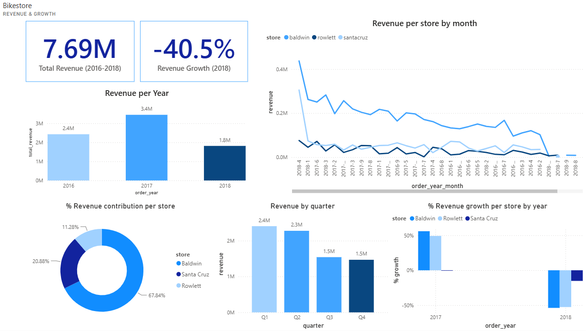
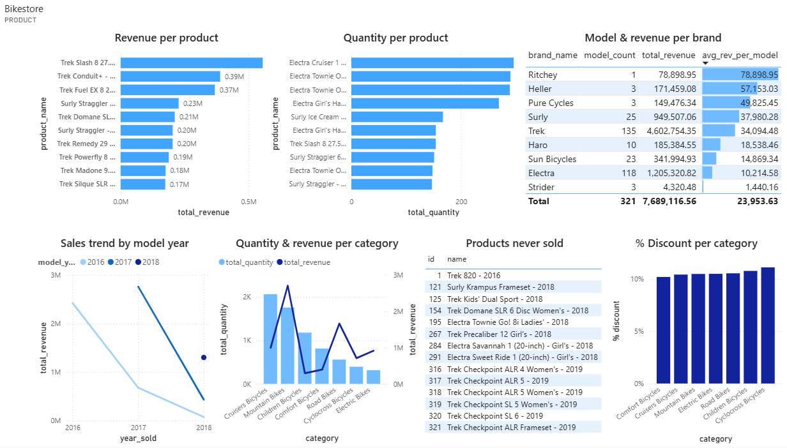
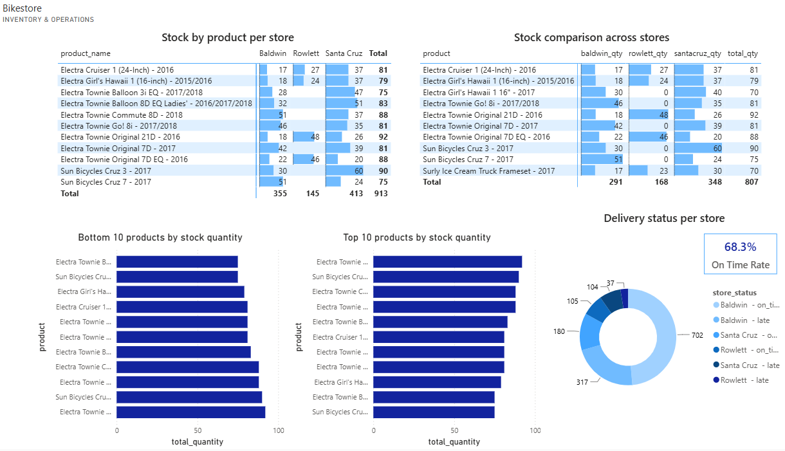
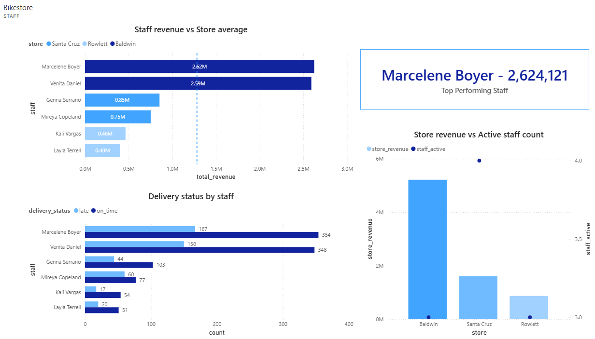
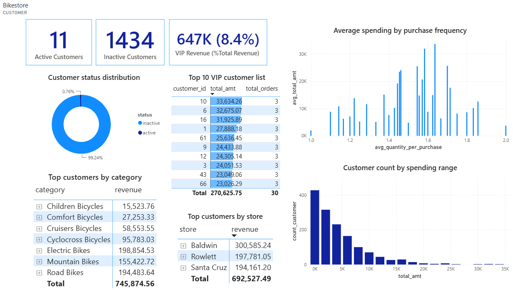

# 🚲 Bike Store Sales & Operations Analytics

**SQL Server → Power BI | End-to-end business intelligence project**

---

## 📌 Business Context

This project simulates a business intelligence engagement for a multi-store bicycle retailer operating 3 locations (**Baldwin, Santa Cruz, Rowlett**). Management needed a single source of truth to understand revenue drivers, product performance, inventory health, staff productivity, and customer retention — but data was scattered across raw transactional tables with no reporting layer.

The goal of this project was to build an **end-to-end analytics solution** — from raw relational data to an executive-ready dashboard — that could answer five core business questions:

1. Where is revenue coming from, and is it growing or shrinking?
2. Which products and brands are performing well — and which are underperforming?
3. Are inventory levels and delivery operations running smoothly across stores?
4. How is staff performance distributed, and who are the top contributors?
5. Are we retaining customers, or relying on one-time buyers?

---

## 🗂️ Dataset & Tools

**Dataset**: [BikeStores](https://www.kaggle.com/datasets/dillonmyrick/bike-store-sample-database) relational sample database — 8+ tables covering `orders`, `order_items`, `products`, `brands`, `categories`, `stores`, `staffs`, and `customers`, spanning 2016–2018.

**Tools & workflow**:
| Stage | Tool | Purpose |
|---|---|---|
| Data extraction & querying | SQL Server (DBeaver) | Wrote 23+ queries across 5 analytical domains |
| Staging & QA | Excel | Consolidated query results, checked data integrity |
| Data modeling | Power BI (Power Query) | Cleaned data types, unpivoted delivery status tables, built relationships |
| Analysis & visualization | Power BI (DAX + Report) | Built custom measures and a 5-page interactive report |
| Reporting | Word | Synthesized findings into a business conclusion report |

**Process highlights**:
- Designed a lightweight star-schema data model with a shared `dim_store` dimension table to enable cross-filtering across all report pages
- Wrote custom DAX measures for KPIs such as On-Time Delivery Rate, Revenue per Model, and Top Performer identification (using `TOPN` + `SELECTEDVALUE`)
- Resolved real-world data modeling issues: ambiguous relationship paths, ambiguous cardinality conflicts after unpivoting, and cross-filter direction conflicts
- Built 5 report pages (Revenue & Growth, Product, Inventory & Operations, Staff, Customer) plus a curated KPI dashboard

---

## 📊 Dashboard Preview

### Revenue & Growth


### Product


### Inventory & Operations


### Staff


### Customer


---

## 🔍 Key Findings

- **Root-cause chain identified**: stock shortages at Rowlett (several best-selling SKUs at 0 units) → lowest store revenue share (11.28%) → likely contributing to a **99.24% customer inactive rate**, as poor product availability and delivery delays hurt repeat purchases.
- **Operational risk**: On-time delivery rate stands at only **68.3%** — nearly 1 in 3 orders is delivered late.
- **Revenue concentration risk**: **67.84%** of total revenue relies on a single store (Baldwin), creating exposure if that location underperforms.
- **Product portfolio inefficiency**: some brands (e.g. Electra, 118 models) generate far lower revenue-per-model than niche brands (e.g. Ritchey, 1 model) — signaling an over-extended SKU catalog.
- **Underdeveloped VIP segment**: the top 10 VIP customers contribute only **8.4%** of total revenue — well below the typical 80/20 benchmark, suggesting the business currently depends on a large base of one-time buyers rather than a strong loyal customer core.

*(Note: 2018 revenue figures are based on partial-year data (through ~Aug–Sep); the -40.5% YoY growth figure should be read with this context, not as a full-year decline.)*

---

## ✅ Recommendations

A 3-phase action roadmap was proposed to address the findings above:

1. **Phase 1 (0–1 month)** — Fix the root cause: restock out-of-stock SKUs at Rowlett; investigate late-delivery causes, prioritizing Baldwin (highest order volume).
2. **Phase 2 (1–3 months)** — Reduce customer churn: launch a win-back campaign targeting one-time buyers; retrain staff with abnormally high late-delivery rates.
3. **Phase 3 (3–6 months)** — Strengthen the operating foundation: build a growth plan for Santa Cruz/Rowlett to reduce revenue concentration; rationalize the underperforming product catalog.

Beyond fixing current issues, four **future growth strategies** were proposed: a formal tiered loyalty program, a "fewer but better" product strategy, replicating Baldwin's high-performing staff practices across other stores, and investing in demand forecasting to prevent future stockouts.

*Full detailed analysis, priority matrix, and DAX-supported metrics are available in the [conclusion report](reports/Bikestore_Conclusion_Report.docx).*

---

## 📁 Repository Contents

```
bikestore-project/
├── sql/
│   └── bikestore_queries.sql        # All 23 SQL queries across 5 analytical domains
├── reports/
│   └── Bikestore_Conclusion_Report.docx   # Full analysis: findings, priority matrix, roadmap
├── images/
│   └── dashboard_*.png              # Dashboard screenshots (5 report pages)
└── README.md
```

📊 **[Download the .pbix file](PASTE_YOUR_GOOGLE_DRIVE_LINK_HERE)** to explore the report interactively in Power BI Desktop (free) — includes working slicers, cross-filtering, and drill-through.

---

## 🛠️ Skills Demonstrated

`SQL` · `Power Query (M)` · `DAX` · `Data Modeling` · `Power BI` · `Data Cleaning` · `Business Analysis` · `Root-Cause Analysis` · `Executive Reporting`
